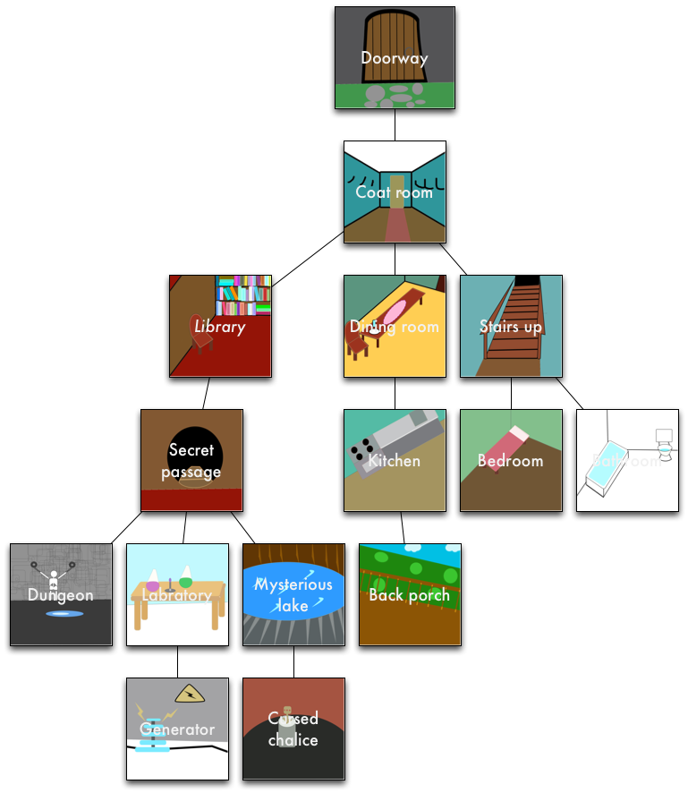
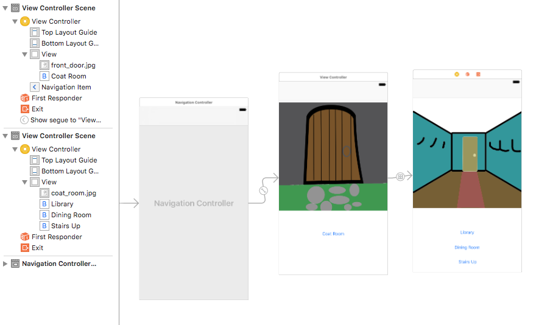

# Entering-a-House-Assignment

Experimenting with UINavigation Controllers
Your local mad scientist has decided to sell their lair. You, relieved that this may improve property values and decrease the amount of grave-robbing, offer to help. They want you to make an app that prospective buyers can use to get a tour of their abode.

You have been provided with this diagram of the layout & images of all the various areas to highlight.

Layout

You can download these images by cloning the repo located here.

Your task is to let people tour this strange place using a UINavigation controller.

Start by creating a new project in Xcode with the "Single View application" template. Add the provided images to your project.

Go to your Main.storyboard, click on the view controller, and embed it in a Navigation Controller (by going Editor > Embed In... > Navigation Controller). Next, add an image view and a button to the view controller.

Set the image of the image view to be the first image (of the front door) and the button text to be Coat Room.

Then you can drag a new view controller in to the storyboard and put in image view in that, setting the image to be the coat room. Next, control-drag from the Coat Room button in the front door view to the coat room view controller. This creates a segue that will cause the app to transition to the next scene when pressed. Next, add buttons for the rooms that can be reached from the coat room.

It should look something like this:

Starting

Continue filling in the rest of the floor plan in the same manner, so the user can navigate the whole house, see all the rooms, and go back when desired.

Finally, add a button to the navbar that will take the vistor all the way back to the first scene no matter where they are. The easiest way of doing this is to make all the view controllers you've made instances of your custom View Controller subclass and set self.navigationItem.rightBarButtonItem in viewDidLoad:.
